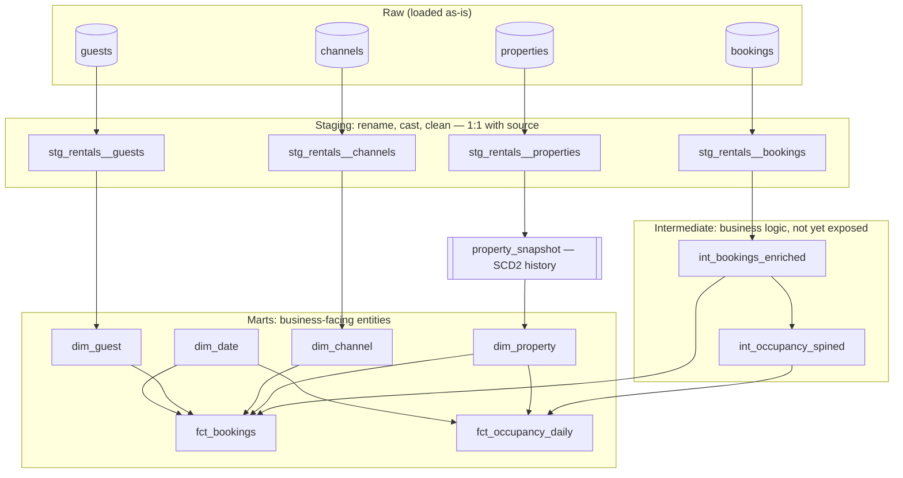
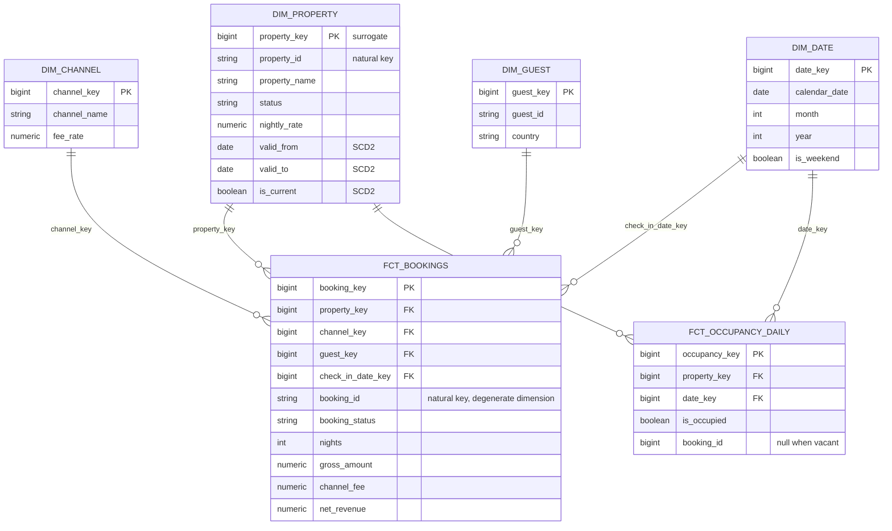

# Architecture

How raw OTA data becomes a queryable star schema, and why each layer exists. This is the design doc behind the [README](../README.md).

## Layered flow: source-conformed → business-conformed

dbt's job here is to move data from the shape external systems hand us (OTA exports, app tables) to the shape the business reasons in (bookings, properties, revenue). Three layers, each with one responsibility.



**Staging** (`stg_*`): one model per source table. Rename to a consistent convention, cast types, fix obvious dirt. No joins, no business logic — staging stays 1:1 with the source so the cleanup lives in exactly one place.

**Intermediate** (`int_*`): the logic that doesn't belong in a final mart and would otherwise be copy-pasted. `int_bookings_enriched` computes nights and net revenue; `int_occupancy_spined` expands each confirmed booking into one row per occupied night.

**Marts**: the tables an analyst or dashboard touches. Dimensions describe entities; facts record events and measures.

## Star schema



## Grain statements

The grain is decided before any SQL is written. It's the single most common thing candidates get wrong.

- **`fct_bookings`** — one row per confirmed booking. Measures (`nights`, `gross_amount`, `channel_fee`, `net_revenue`) are additive across every dimension.
- **`fct_occupancy_daily`** — one row per property per calendar date. `is_occupied` is non-additive (it's a state, not a sum); occupancy *rate* is derived at query time as occupied days / total days.

## SCD2 on `dim_property`

Property attributes change and history matters for revenue attribution. Captured with a YAML snapshot using the current (dbt 1.9+) config:

```yaml
# snapshots/property_snapshot.yml
snapshots:
  - name: property_snapshot
    relation: ref('stg_rentals__properties')
    config:
      unique_key: property_id
      strategy: check
      check_cols: [property_name, status, nightly_rate]
      hard_deletes: new_record          # delisted properties stay in history
      dbt_valid_to_current: "9999-12-31"
      snapshot_meta_column_names:
        dbt_valid_from: valid_from
        dbt_valid_to: valid_to
        dbt_is_deleted: is_deleted
```

`dim_property` reads from the snapshot and exposes `valid_from` / `valid_to` / `is_current`. A booking joins to the property version whose validity window contains the booking date — so March revenue reflects the March rate, even after a price change.

## Incremental `fct_bookings`

Bookings mutate after creation, so the fact is incremental rather than full-refresh:

```sql
{{ config(
    materialized='incremental',
    unique_key='booking_id',
    incremental_strategy='delete+insert'
) }}

select ...
from {{ ref('int_bookings_enriched') }}

  where updated_at >= (select max(updated_at) from {{ this }}) - interval '3 days'

```

The 3-day lookback re-pulls recently changed bookings so status flips and payout adjustments land without a full rebuild. `delete+insert` on `booking_id` is the safe Postgres choice; on Snowflake this becomes `merge` (one of the porting changes for the next project). For high-volume event streams the modern alternative is the `microbatch` strategy — noted as a deliberate non-choice here because booking volume doesn't warrant it.

## Why this ports cleanly to Snowflake + Airflow

Two things are Postgres-specific: the `delete+insert` incremental strategy (becomes `merge` on Snowflake) and the `generate_series` night-explode in `int_occupancy_spined` (becomes a join to a date spine). Everything else — the staging/intermediate/marts split, the snapshot, the tests, the grain decisions — moves to Snowflake unchanged; Airflow + Cosmos will run these same models as scheduled, retryable, monitored tasks. That's the next portfolio piece, not this one.
